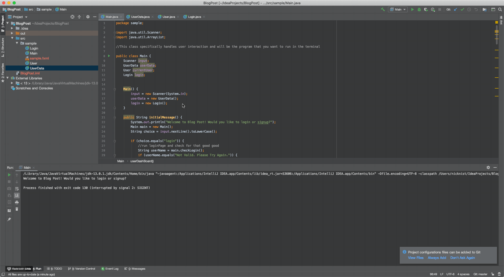
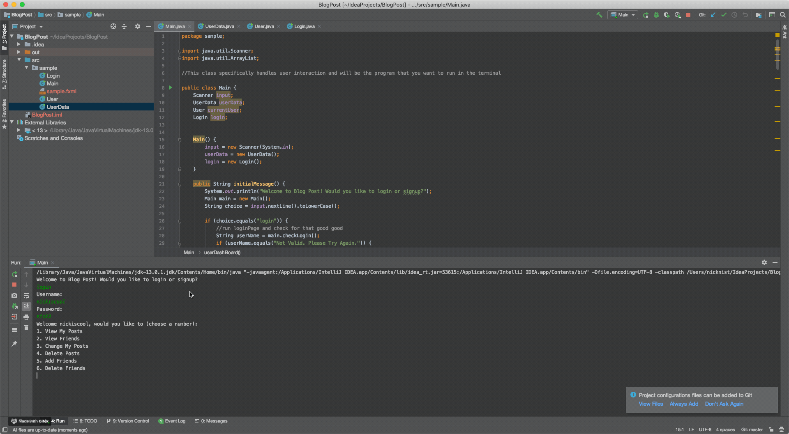
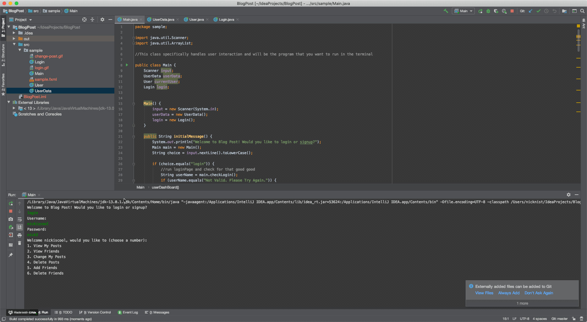

# Practice Java Blog Post Program

## Project Overview:

This is a practice Java program that I put together in order to get a deeper understanding of how the language works.

This program starts off with 3 default users: 
1. Nick - UserName: nickiscool - Password: nick3
2. Ben - UserName: beniscool - Password: ben3
3. John - UserName: johniscool - Password: john3

Things that a user is able to do:
1. View My Posts
2. View Friends
3. Change My Posts
4. Delete Posts
5. Add Friends
6. Delete Friends
7. Logout

## Setup:
In order to run this program, you can start by cloning down this repo. Since this is in java, you will need to compile the java files into class files, so from the directory run this command to compile your classes: 
```
javac -cp lib/practiceCRUD.jar -d classes src/sample/Main.java src/sample/Login.java src/sample/User.java src/sample/UserData.java
```

Once your files have compiled, use this command to run the program!
```
java -cp lib/practiceCRUD.jar:classes sample.Main
```

## Wins:
* This project was really enjoyable to learn a new language, especially one that is so explicit with the way that variables are written. Coming from JavaScript, this language was easy to understand with classes but some of the intricacies took a while to fully understand how it works.
* As a user, you are able to add friends, delete friends, change a post, delete a post, view your friends, and view your posts.
* As a JavaScript user, this was a learning experience to use an IDE for the first time while using Java. I used IntelliJ and realized near the end of the project that I did not know how to push from GitHub from IntelliJ and learned to make a big commit.

## Future Iterations:
* I would like to add a 'persistent state' of the data on this program so that when things happen, they persist and continue to be true. For example, if you add a friend, when you come back later the friend should be there.

## Working Demo:
### Initial Login:


### Changing a Post:


### Deleting a Friend:


### GitHub:

[Nick Nist](https://github.com/nicknist)
